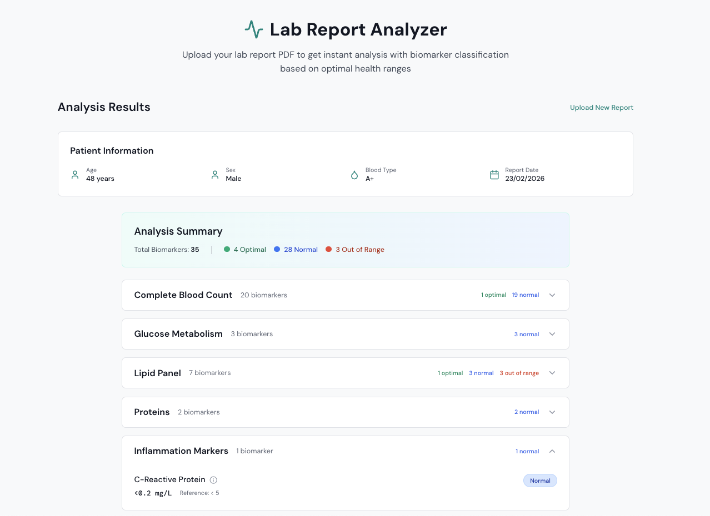

# Lab Report Analyzer 🔬

A modern web application that analyzes Spanish-language lab reports (Eurofins-style PDFs), extracts biomarkers, translates them to English, standardizes units, and classifies results as **optimal**, **normal**, or **out of range** based on age and sex-specific reference ranges.


## 📹 Demo

[](./images/demo_video.mp4)



---

## 🎯 Features

- **PDF Processing** - Extracts text from Spanish lab report PDFs
- **AI-Powered Extraction** - Uses Claude (Anthropic) to structure and translate biomarker data
- **Smart Classification** - Deterministic 3-tier classification (optimal/normal/out-of-range)
- **Age & Sex Specific** - Applies different optimal ranges based on patient demographics
- **Bilingual Support** - Preserves original Spanish names alongside English translations
- **Unit Standardization** - Converts to international standard units
- **Visual Progress Bars** - Shows biomarker values with optimal range indicators
- **Error Handling** - Specific error messages for different failure scenarios
- **Modern UI** - Clean, responsive interface built with React and Tailwind CSS

---

## 🏗️ Architecture

```
┌─────────────┐
│   Client    │  React + Vite + Tailwind CSS
│  (Port 5174)│  File upload, results display
└──────┬──────┘
       │ HTTP
       ▼
┌─────────────┐
│   Server    │  Express + TypeScript
│  (Port 3001)│  PDF processing, classification
└──────┬──────┘
       │
       ├──► PDF Extraction (pdf-parse)
       ├──► Claude API (Anthropic)
       └──► Classification Engine
```

---

## 🚀 Quick Start

### Prerequisites

- Node.js 18+ and pnpm
- Anthropic API key ([get one here](https://console.anthropic.com/))

### Installation

```bash
# Clone the repository
git clone <repo-url>
cd axo-longevity

# Install dependencies
pnpm install

# Set up environment variables
cp .env.example .env
# Edit .env and add your ANTHROPIC_API_KEY
```

### Running the Application

**Development Mode:**
```bash
# Start both client and server
pnpm dev

# Or run separately:
pnpm dev:server  # Server on http://localhost:3001
pnpm dev:client  # Client on http://localhost:5174
```

**Production Build:**
```bash
# Build both packages
pnpm build

# Start server
pnpm --filter server start
```

### Testing

**With Mock Data (no API calls):**
```bash
echo "USE_MOCK_DATA=true" >> .env
pnpm dev
```

**With Real API:**
```bash
# Remove mock mode and upload a PDF through the UI
# Or test with curl:
curl -X POST http://localhost:3001/api/report/upload \
  -F "file=@report.pdf"
```

---

## 🧬 Classification Logic

The system uses a **3-tier classification** approach:

| Classification | Criteria |
|---------------|----------|
| **Out of Range** | Value is outside the lab's reference range |
| **Normal** | Value is within reference range but outside optimal range |
| **Optimal** | Value is within a tighter, age/sex-specific optimal range |

### Example: Total Cholesterol

- **Reference Range**: 0-200 mg/dL (from lab report)
- **Optimal Range**: ≤180 mg/dL (from our config)
- **Value**: 209 mg/dL → **Out of Range**
- **Value**: 190 mg/dL → **Normal**
- **Value**: 170 mg/dL → **Optimal**

Optimal ranges are defined in `packages/server/src/config/optimalRanges.ts` with age and sex variations.

---

## 🔧 Tech Stack

### Server
- Express + TypeScript
- pdf-parse (PDF text extraction)
- Anthropic SDK (Claude API)
- Zod (schema validation)
- Multer (file uploads)

### Client
- React 18 + Vite
- Tailwind CSS
- react-dropzone (file upload UI)
- Axios (HTTP client)
- Lucide React (icons)

---

## 📁 Project Structure

```
axo-longevity/
├── packages/
│   ├── server/
│   │   ├── src/
│   │   │   ├── routes/report.ts           # Upload endpoint
│   │   │   ├── services/
│   │   │   │   ├── pdfExtractor.ts        # PDF processing
│   │   │   │   ├── claudeClient.ts        # Claude integration
│   │   │   │   ├── biomarkerClassifier.ts # Classification logic
│   │   │   │   └── mockData.ts            # Test data
│   │   │   ├── config/optimalRanges.ts    # Optimal ranges
│   │   │   └── index.ts                   # Express app
│   │   └── API.md                         # API documentation
│   └── client/
│       ├── src/
│       │   ├── components/                # React components
│       │   ├── lib/api.ts                 # API client
│       │   └── App.tsx                    # Main app
│       └── package.json
├── .env                                   # Environment variables
├── DEPLOYMENT.md                          # Deployment guide
└── README.md
```

---

## 📊 API Documentation

See [`packages/server/API.md`](./packages/server/API.md) for complete API documentation.

**Main Endpoint:**
- `POST /api/report/upload` - Upload PDF and get analysis

**Error Codes:**
- `NO_FILE`, `EMPTY_FILE`, `FILE_TOO_LARGE`, `INVALID_FILE_TYPE`
- `CORRUPTED_PDF`, `ENCRYPTED_PDF`, `EXTRACTION_FAILED`
- `QUOTA_EXCEEDED`, `TIMEOUT`, `SERVICE_UNAVAILABLE`

---

## 🚢 Deployment

See [`DEPLOYMENT.md`](./DEPLOYMENT.md) for production deployment instructions.

**Recommended Stack:**
- Frontend: Vercel
- Backend: AWS ECS Fargate
- Secrets: AWS Secrets Manager

**Estimated Costs:** ~$53-60/month for production deployment

---

## 🔐 Environment Variables

```bash
# Required
ANTHROPIC_API_KEY=sk-ant-your-key-here

# Optional
PORT=3001
USE_MOCK_DATA=false  # Set to 'true' for testing
NODE_ENV=development
```

---

## 🛠️ Development

### Available Scripts

```bash
pnpm dev              # Run both client and server
pnpm dev:server       # Run server only
pnpm dev:client       # Run client only
pnpm build            # Build both packages
pnpm --filter server build
pnpm --filter client build
```

### Adding New Optimal Ranges

Edit `packages/server/src/config/optimalRanges.ts`:

```typescript
export const optimalRanges: Record<string, OptimalRangeConfig> = {
  vitamin_d: {
    male: { default: { min: 40, max: 80 } },
    female: { default: { min: 40, max: 80 } }
  }
};
```

Use normalized English names (lowercase, underscores, no special chars).

---

## 🎨 UI Features

- **Drag & Drop Upload** - Easy PDF file selection
- **Loading States** - Animated skeleton loaders during processing
- **Error Messages** - User-friendly error handling
- **Patient Info Card** - Displays age, sex, blood type, report date
- **Biomarker Cards** - Shows value, reference range, classification
- **Progress Bars** - Visual indicators with optimal range zones
- **Category Sections** - Collapsible groups by medical category
- **Classification Badges** - Color-coded (green/blue/red)

---

## 🐛 Troubleshooting

**"Insufficient credits" error:**
- Add credits at [console.anthropic.com](https://console.anthropic.com/)

**CORS errors:**
- Ensure server allows client origin in CORS config
- Check `packages/server/src/index.ts`

**PDF extraction fails:**
- Ensure PDF contains extractable text (not image-based)
- Check file is not encrypted/password-protected

**Classification shows all "normal":**
- Verify biomarker name matches key in `optimalRanges.ts`
- Names are normalized (lowercase, underscores)

**Timeout errors:**
- Claude API can take 30-40 seconds
- Client timeout is set to 60 seconds
- Ensure server timeout is adequate

---

## 📝 License

MIT

---

## 🙏 Acknowledgments

- **Anthropic** for Claude API
- **Eurofins** for lab report format reference
- Built for the Axo Longevity coding challenge

---

## 📮 Contact

For questions or issues, please open a GitHub issue.
